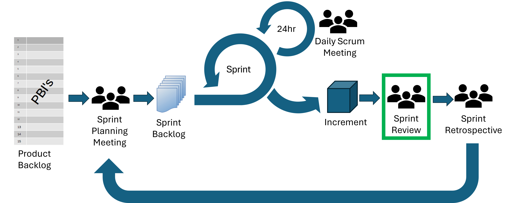
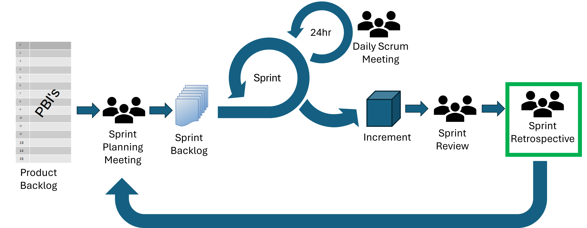
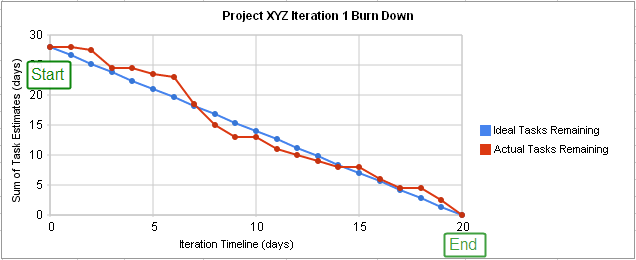

::: questions
- How do you identify tasks that need to be completed as part of the software development process?
- What methods can you use to estimate how long a task will take?
- What activities are involved in a typical Agile sprint?
:::

::: objectives
- Learn how to write user stories.
- Estimate the effort required for a task.
- Be able to participate effectively in an Agile sprint.
:::

# Working out What To Do

In this section, we'll introduce two established key concepts for capturing the needs of a project,

- *User stories*, which capture what is needed from solely the perspective of the client
- *Requirements*, which state what needs to be built (or what needs to change) by the development team

So whilst they both capture what the software will do,
each reflects one side of the client/developer perspective.

## User Stories

Capturing "requirements" is pivotal to understanding what needs to be built,
but whilst they state what is technically required,
they lack the end-user context of what they are and why they are important.
User stories aim to capture this perspective, being short and simple descriptions of new features or functionality from the perspective of the end user themselves.
Therefore, user stories help:

- The project remains *user-centered* and *focused on real needs*,
rather than jumping prematurely to solution or technical requirements
- To clarify the the *value* behind a feature,
and anchor development in *user outcomes*, not just functionality
- Prevent requirements ballooning, if not guided by real user goals
- Prioritise what matters to users
- Provide a *concise* description of value - they should be short and encapsulate a single aspect

They typically follow the following template,
to ensure user stories are clear and concise:

> As a *[type of user]*, I want *[an action]* so that *[benefit]*.

Breaking each of these three aspects down:

- "As a *[type of user]*": who are we building this for? There may be more than one type of user, but in any case we need to think about this from the user's perspective.
- "I want *[an action]*": this describes the intent of this type of user, not the features of the system. What do they want to achieve?
- "so that *[benefit]*": what is the benefit they are trying to realise? How will it help them directly, solve a problem for them?

Some examples of user stories include:

- E-commerce site: as a shopper, I want to add items to my cart so that I can purchase multiple products at once
- Mobile application: as a user, I want to receive push notifications for important updates so that I stay informed when I'm not using the app

As mentioned, note that they are short and to the point, and each encapsulate a single aspect.

::: challenge

### User Story Activity

You are working on a research team and on a novel image classification model. You want software which can train the model, which can perform inference, and you want to be able to demonstrate the model at trade shows, conferences and outreach activities. You want to publish the software and weights as an open source project.

Spend a few minutes to write down some user stories.

::: solution

There's no right or wrong answers, but here are some examples.

- As a *researcher* I want *to train the model* so that *I can validate my ideas*.
- As a *researcher* I want *to test model checkpoints* so that *I can explore progress when training*.
- As a *researcher* I want *to be able to compute inference metrics on test data* so that *I can compare performance with other competing image classification models*.
- As a *research collaborator* I want *to install and run the software* so that *I can use the model to classify images from my research.*
- As a *member of the public* I want *to interactively classify objects* so that *I can understand the potential of the technology,*

:::

:::

## Requirements

In general, a requirement is a *capability or condition that must be met for software to solve a problem or address a need*. They form the foundation of our project and drive what will be developed, so if we do not properly explore and understand what is required, the software will not be suitable for it's intended purpose.

Whilst user stories focus purely on the user perspective, requirements concentrate on what technically needs to change. For this reason, it's common to develop user stories first (to understand the user), then from those stories, derive requirements (to understand what needs to be built). Requirements typically address technical aspects of software functionality and features that are needed to complete a user story, and are more numerous than the collection of user stories. Therefore, each user story is often addressed by more than one requirement.

There is repeated evidence that most errors aren't actually introduced during the software development stage, but during requirements analysis and design.
For example, [one analysis](https://doi.org/10.1109/ISRE.1993.324825) of the software errors uncovered during integration and testing and the Voyager (1977) and Galileo (1989) probes discovered that 79% of these errors were due to a poor understanding of requirements.

However, it is unlikely that we will be able to determine all of the requirements correctly and completely upfront. In practice, very often requirements may need be flexible to some extent and may change as the project evolves, so we need to ensure we are able to accommodate any agreed changes.

### Requirements are More than just Features

When considering software requirements, it is very tempting to just think about the features users need.
However, many design choices in a software project depend on the users themselves and the environment in which the software is expected to run (as well as *how* the software should run),
and these aspects should be considered as part of the software’s *non-functional* requirements.

To explore the importance of this aspect, let's consider two software types, mobile applications and embedded software.
They may appear similar, but examining the environments in which they are developed and operate uncovers many differences that need to be accounted for in order for the software to be fit for purpose.

| Concern   | Mobile Apps | Embedded Software
|-----------|-------------|------------------
| Platform | Work on range of mobile hardware and iOS/Android operating systems | Exact specification of hardware is known - often not necessary to support multiple devices; typically low power
| Development Language | Typically written in one of the higher-level platform preferred languages (e.g. Java, Kotlin, Swift) | Typically lower-level language (e.g. C) for better control of resources
| Compilation | Users will not (usually) modify / compile the software | Users will not (usually) modify / compile the software
| Installation | Usually distributed via a controlled app store | Usually distributed pre-installed on a physical device
| Interface | Must have graphical interface suitable for a touch display | May have no user interface, or interface may be physical buttons
| Documentation | Probably in the software itself or on a Web page | Documentation probably in a technical manual with a separate user manual
| Uptime | May not run continuously due to restarts | May need to run continuously for the lifetime of the device

Therefore, whilst a single piece of software may provide the same *functionality* on a mobile app or embedded device (for example, a photo frame application),
the other *non-functional* considerations describe facets of how the software must be developed and how it must operate (often as constraints),
and we must account for them in our requirements.

Some typical classes of non-functional categories include:

- Security: how do we ensure a user is authenticated and authorised to conduct a particular action?
- Performance: what performance goals will the software be required to satisfy?
- Usability: how will the user interact with the software?
- Reproducibility: how do we ensure others are able to reproduce results generated using the software?
- Portability: to what extent should the software be able to run on different systems with minimal changes?
- Maintainability: how easily can the software be modified, enhanced, or restructured?
- Reliability: to what extent should the software we able to operate without errors and unexpected failures?
- Availability: to what extent should the software remain accessible and operational when needed?

A more comprehensive list can be found [on Wikipedia](https://en.wikipedia.org/wiki/Non-functional_requirement#Examples).

::: spoiler

#### Mars Climate Orbiter

The [Mars Climate Orbiter](https://en.wikipedia.org/wiki/Mars_Climate_Orbiter) was a 1998 NASA mission to study the climate and atmosphere of Mars.  The mission was famously lost during the Mars orbit insertion manoeuvre when the software for computing the impulse of thrust from the orbiters engine, developed by Lockheed Martin, gave results in US customary units of pounds-force seconds, but the NASA software expected inputs in SI units of newton-seconds.  The result was incorrect values fed into the trajectory computation system and loss of the orbiter.

Lockheed Martin's software did not adhere to the requirements document which specified SI outputs, but this discrepancy was also not caught by NASA.

It isn't sufficient to have requirements; they must also be *verified* and *validated*.

:::

### Capturing Requirements in a Product Backlog

A *product backlog* is a prioritised list of functionality that a product should contain; essentially, a list of work for the development team. It represents everything that might be needed in the product and is the single source of truth for all work. They include requirement-related aspects such as features, bugs, improvements, and non-functional requirements, but also any other supporting tasks such as any needed research (also known as *spikes*), and other implementation-related tasks (like cleaning up/refactoring code).

A product backlog is owned by the *product owner* (the client), and is dynamic, in that it evolves as the needs of the product evolves. Regular backlog refinement sessions throughout a project ensure items are updated, estimated, re-prioritised if necessary, and ready for upcoming sprints.

::: challenge

### Requirements Activity

You are working on a research team and on a novel image classification model. You want software which can train the model, which can perform inference, and you want to be able to demonstrate the model at trade shows, conferences and outreach activities. You want to publish the software and weights as an open source project.

Look at some of the user stories from the previous challenge, and think about some requirements. Also consider non-functional requirements that may be implicit in the

::: solution

There's no right or wrong answers, but here are some examples.

Consider two possible user stories and how they impact requirements:

- As a *researcher* I want *to train the model* so that *I can validate my ideas*.
- As a *researcher* I want *to test model checkpoints* so that *I can explore progress when training*.

You might get requirements like the following for training the model:
- the software must be able to create an untrained model of the experimental architecture
- the software must be able to train the model from scratch
- the software must be able to save checkpoints at user-specified intervals
- the software must be able to resume training from a saved checkpoint
- the software must be able to report progress in terms of both loss and user-specified metrics

You might also get non-functional requirements, such as:
- the software must support replication (eg. by setting random number seeds)
- the software must have unit tests
- the software must be written in Python using the Pytorch library

:::

:::

## Estimation

Once we have an initial set of requirements captured, we need to understand their importance in relation to each other: essentially we need to prioritise them.

But before we can prioritise our requirements, there are some things we need to find out.

Firstly, we need to know:

- *The period of time we have to resolve these requirements* - e.g. before the next software release, pivotal demonstration, or other deadlines requiring their completion.
- *How much overall effort we have available* - i.e. who will be involved and how much of their time we will have during this period.

We also need estimates for how long each requirement will take to resolve, since it's difficult to meaningfully prioritise requirements without knowing what the effort tradeoffs will be. Even if we know how important each requirement is, how would we even know if completing the project is possible? Or if we do not know how long it will take to deliver those requirements we deem to be critical to the success of a project, how can we know if we can include other less important ones?

It is often not the reality in practice, but estimation should ideally be done by the people likely to do the actual work: the developers themselves. It shouldn't be done by project managers or those otherwise not involved in development, simply because they are not best placed to estimate, and those doing the work are the ones who are effectively committing to these figures. As well as lacking the inherent technical skills required to estimate, having senior non-development roles dictating estimates is that they are at risk of non-development biases such as idealised project timelines and goals which may not be achievable.

### Tasks

Requirements, particularly non-functional requirements, rarely map directly onto actual distinct work items, or **tasks**, that need to be done. For a functional requirement, when all of the tasks that compose it are done, it *should* be complete. There is some difference in terminology found in the Agile world for these things: some teams would consider a "task" to simply be a more fine-grained requirement, other teams would refer to top-level requirements as **epics**.

For example, a requirement to have a login page on a website might be split into smaller tasks to write the backend login web API, and a task to write the frontend UI (and possibly still further tasks to set up the database tables and infrastructure to securely store and retrieve login information); and some of these work items may intersect with non-functional requirements (such as security requirements).

There are some things that should *never* be split out into a separate task. For example tests of changes made to the code as part of the task are *always* part of the task, as is ensuring code quality, and writing/updating relevant developer documentation regarding the task.

It is these smaller tasks that form the basis of estimation.

::: spoiler

### Time-boxing

Time-boxing is the practice of assigning a limit to the amount of time to spend on a task. This can be done at the small-scale, such as limiting the time of stand-up meetings to a few minutes to the very large, such as specifying a length of time before the first release of a piece of software.

Perhaps the most common usage is when dealing with tasks of unknown complexity, particularly bugs.

If the task is completed within the assigned time everything is good, but if you reach the end of the allocated time and haven't completed the task, you stop and do an analysis of the remaining effort until the task is done.

If the remaining effort is small, you might simply continue; but if it is large, it might make more sense to create a new task that captures the remaining effort, an estimate of that effort (hopefully with more data to give confidence in that estimate), and a prioritization of the task compared to other uses of the time.

This helps avoid situations where a developer is spending a lot of time doing poorly-specified and less-important things and losing velocity, instead of doing things which are advancing the project more quickly and directly.

:::

### Point Estimation and Velocity

A common method used in Agile software development to simply assign points to tasks depending on how "big" they seem. When thinking of effort, these numbers should scale linearly: a 5-point task should be roughly 5 times bigger than a 1-point task. These points are abstract: they shouldn't have an explicit time estimate associated with them (although that may implicitly emerge over the course of multiple sprints). By not having a time estimate associated with them, it avoids the pressure of committing to a particular time target for a task. Different teams may have different ideas of what they consider a "1-point" issue or a "5-point" issue.

When considering effort, you should include not just the effort to write the code, but also the time to write tests, review the code and fix defects, write documentation, and other parts of the task. Something which is a 10 minute bugfix to a single line of code likely still needs regression tests, time for continuous integration to run, code review to be performed, change-logs to be updated, and so-on.  Even the most trivial of things is likely to take at least an hour of developer working time, and usually at least a couple of hours of elapsed "wall-clock" time.

When assigning points, a commonly used scale follows a Fibonacci sequence. This prevents small-scale worrying about "is this an 8 or a 9" by presenting a more limited selection of choices:

| Points | Description             |
| ------ | ----------------------- |
| 1      | Very quick and easy     |
| 2      | Small effort            |
| 3      | Medium effort           |
| 5      | Large effort            |
| 8      | Very large              |
| 13     | Extremely large/unclear |

Each developer in the team looks over the issues under consideration for the sprint, and assigns a number based on their understanding of the complexity and time it would likely take. The team then compares their estimates, discusses any differences in their estimates, and comes to a consensus on the point value of the task.

If a task is considered large (maybe 8 or 13 points or larger, it depends on the team) then it's likely to big or too vaguely specified to be a good task for a single sprint, and so it should be broken up into smaller sub-tasks, and those tasks estimated.

Once a requirement is broken into tasks, the tasks estimated, the estimates agreed-upon, at that point you have an estimate for the total effort required for the original requirement.

Over time this approach gives a number of advantages:

- it allows a team to develop a consistent sense of the effort required for a task
- over time the team will likely consistently complete tasks totalling a certain amount of points during a sprint, and that is likely to be consistent over time.

That total of points is sometimes called the "velocity" of the team, and helps with sprint planning. For example, if you know that your team can usually completes tasks worth between 30 to 40 total points in a sprint, that gives a rough estimate about what might be achieved in a future sprint. Sprint velocities should never be used outside of a team because what a point represents may vary considerably, and [should never be used as an explicit target: they are a measurement, not a goal](https://en.wikipedia.org/wiki/Goodhart%27s_law).

The velocity also gives a sense of how much effort a "point" is in terms of time taken, but even that may vary as a team becomes more familiar with the problems they are trying to solve and the codebase they are working on.  Other factors can increase velocity without changing point estimates, for example a refactor which makes it easier to add new features can dramatically increase velocity, which will change how much time a 'point' represents.

Point estimates can also be used as a constraint on effort, particularly for tasks with a lot of uncertainty in what they involve.  If the effort to complete a task seems to be growing outside the size of the estimate (for example a 2-point starting to look more like a 3-point or more), development can be paused and the estimate revisited based on what has been learned so far, and possibly even deferred if other tasks have higher priority.

:::::::::::::::::::::::::::::::::::::::::  callout

### Why is it so Difficult to Estimate?

Estimation is a very valuable skill to learn, and one that is often difficult. Lack of experience in estimation can play a part, but a number of psychological causes can also contribute. One of these is [Dunning-Kruger](https://en.wikipedia.org/wiki/Dunning%E2%80%93Kruger_effect), a type of cognitive bias in which people tend to overestimate their abilities, whilst in opposition to this is [imposter syndrome](https://en.wikipedia.org/wiki/Impostor_syndrome), where due to a lack of confidence people underestimate their abilities.

Another reason it is difficult is that you make correctly estimate the time taken to do the "core" of the task (say, to fix a bug) but not the time to do the associated work to truly finish the task (such as building the software, testing, review, and documentation). These can take more time than the main task in some cases.

The key message here is to be honest about what you can do, and find out as much information that is reasonably appropriate before arriving at an estimate, and don't worry too much if it turns out to be wrong: it is, after all, an *estimate*.

More experience in estimation will also help to reduce these effects. So keep estimating!

::::::::::::::::::::::::::::::::::::::::::::::::::

:::::::::::::::::::::::::::::::::::::::: callout

## General Tips for a Successful Estimation Session

- Avoid mapping sizes to exact hours/days
- Focus on relative sizing between stories
- Discuss outliers - why does someone see it as a 1 when others see 5?
- Use the discussion to uncover unknowns or assumptions about the requirements, and clarify them in the product backlog

::::::::::::::::::::::::::::::::::::::::::::::::

The exercise of taking a requirement, splitting it into tasks, and estimating the effort does not need to be performed immediately. It is only at the point where work is actively being considered on it that you need to know what the tasks are and the effort required. Particularly early on in a project it may be difficult to know what the tasks are for a requirement.

To an extent, the *process* of deciding estimates is more important than the actual result of estimation. Creating estimates forces the team to consider the detail of what will be required to fulfil a requirement, beyond just coming up with a number. For example, when coming up with an estimate it may become clear there are unrealised dependencies between tasks, or some requirements are not readily estimable due to being too complex or too widely scoped, and require further decomposition into multiple smaller requirements to estimate properly. It may also become clear that some requirements may not be achievable at all within the timeframe of the project!

## Prioritization

Now we have our estimates we can decide how important each requirement is to the success of the project. This should be decided by the project stakeholders; those - or their representatives - who have a stake in the success of the project and are either directly affected or affected by the project, e.g. clients, end-users, collaborators, etc.

To prioritise these requirements we can use a method called **MoSCoW**, a way to reach a common understanding with stakeholders on the importance of successfully delivering each requirement for a timebox. MoSCoW is an acronym that stands for **Must have**, **Should have**, **Could have**, and **Won't have**. Each requirement is discussed by the stakeholder group and falls into one of these categories:

- *Must Have* (MH) -
  these requirements are critical to the current timebox for it to succeed.
  Even the inability to deliver just one of these would cause the project to be considered a failure.
- *Should Have* (SH) -
  these are important requirements but not *necessary* for delivery in the timebox.
  They may be as *important* as Must Haves, but there may be other ways to achieve them or perhaps they can be held back for a future development timebox.
- *Could Have* (CH) -
  these are desirable but not necessary, and each of these will be included in this timebox if it can be achieved.
- *Won't Have* (WH) -
  these are agreed to be out of scope, perhaps because they are the least important or not critical for this phase of development.

In typical use, the ratio to aim for of requirements to the MH/SH/CH categories is 60%/20%/20%. Importantly, the division is by the requirement *estimates*, not by number of requirements, so 60% means 60% of the overall estimated effort for requirements are Must Haves.

Why is this important? Because it gives you a unique degree of control of your project for each time period. It awards you 40% of flexibility with allocating your effort depending on what's critical and how things progress. This effectively forces a tradeoff between the effort available and critical objectives, maintaining a significant safety margin. The idea is that as a project progresses, even if it becomes clear that you are only able to deliver the Must Haves for a particular time period, you have still delivered it *successfully*.

# Sprints

A "sprint" in Agile is a fixed-length event, usually between one week and one month in length. All work towards filling requirements is contained within sprints.

There are typically four events within a Sprint:

-   Sprint Planning Meeting
-   Daily Scrum Meeting
-   Sprint Review
-   Sprint Retrospective

::: spoiler

### Open Source "Sprints"

In the open source world, there is a different notion of a "sprint" which is a gathering of developers to work on a project, usually in person, and frequently associated with a conference or other gathering. This is an opportunity for distributed teams to work together on tasks, bring other developers onto the team, and collaborate with other related projects who are also attending the sprint.

:::

## Sprint Planning

{alt='diagram of events with sprint planning highlighted'}

The Sprint Planning Meeting is the kickoff meeting for the Sprint. During this meeting the Scrum Team will decide what's most important, how much can realistically get done, and how you'll make it happen.

The Product Owner, Scrum Master and Developers all attend the Sprint Planning meeting. Other people may also be invited to attend to provide advice.

Sprint Planning needs to answer three questions:

1.  **Why is this Sprint valuable?**
    -   The Product Owner explains how this Sprint will add value. For example, what improvements or new features will benefit the users.
    -   Based on this, the Scrum Team collaboratively decides on the Sprint Goal, which should be a single, unifying goal for the Sprint.
    -   The Sprint Goal must be finalised before the end of the Sprint Planning Meeting.
2.  **What can be Done this Sprint?**
    -   Next, the Developers work with the Product Owner to select the highest-priority Product Backlog items that they feel confident they can complete. This might involve refining or breaking down the items to make sure the whole Scrum Team knows what's involved.
    -   Estimating the amount of work that will fit into one Sprint can be difficult but basing the estimates on past performance, upcoming capacity and the Definition of Done can improve the accuracy of estimates.
3.  **How will the chosen work get done?**
    -   For each item selected from the Product Backlog, the Developers plan the specific tasks needed to turn ideas into a working Increment.
    -   Often, Developers will break large items into smaller, more manageable chunks that will take one day or less.
    -   The Developers decide how to do the work. The Developers are in charge of this, no one else can tell them how to build the solution.

The output from your Sprint Planning Meeting should be your Sprint Backlog including:

-   A Sprint Goal
-   The subset of items from the Product Backlog that you will work on this Sprint
-   A plan for delivering the Increment by the end of the Sprint

A Sprint Planning Meeting should be an absolute maximum of eight hours for a one month Sprint in a large and complex project, and should be shorter for shorter Sprints. Time-boxing the meeting keeps the discussion focussed and allows the Scrum Team to start making delivering value fast.

For a typical research project, an hour should be more than enough time.

## Development

## Daily "Stand-up"

{alt='diagram of scrum events and artifacts with daily meeting highlighted'}

The Scrum Team meet each day to inspect progress toward the Sprint Goal, adapt the Sprint Backlog and adjust plans for upcoming work.

The Daily Scrum Meeting helps the Scrum Team:

-   See progress toward the Sprint Goal
-   Surface and solve problems faster
-   Make quick decisions
-   Reduce the need for additional meetings
-   Keep momentum going with clear next steps

This meeting should usually last no longer than 15 minutes and is usually held in the same time and place every working day of the Sprint.  The Daily Scrum can take any structure and use any techniques as long as it focuses on progress toward the Sprint Goal and produces a plan for the next day of work.

Usually each developer would cover:

-   What you did yesterday
-   What you plan to do today
-   Anything that's blocking you

During a Daily Scrum Meeting, focus on exchanging information with others in the group not just talking about what you've been doing.

The Daily Scrum Meeting isn't the only time that Developers can discuss and adjust their plans.
Developers can also meet throughout the day to re-adjust plans or to have more detailed discussions.

## Sprint Review

{alt='diagram of scrum events and artifacts with sprint review highlighted'}

A Sprint Review takes place at the end of each sprint and brings the Scrum Team together with clients and other stakeholders. It is an opportunity for everyone involved to see what has been accomplished during the sprint and to reflect on progress together.

During the review, the Scrum Team shares the work they have completed, often by demonstrating new or updated features. Stakeholders are encouraged to ask questions, give feedback, and discuss priorities. This conversation helps the team decide what to focus on next and highlights any changes in requirements or circumstances that could affect future work. The Product Backlog is then updated to reflect these new insights.

A Sprint Review should be a collaborative working session rather than just a presentation.

The Sprint Review would be timeboxed to four hours for a one month Sprint but will be much shorter, only 30 minutes, for our mini Sprint.

### Strategies for Communicating Effectively with a Client during a Sprint Review

- **Focus on demonstrating real work**.  Show working features rather than describing them in abstract terms. This helps clients understand progress clearly and gives them confidence in what has been achieved.
- **Explain decisions and context**. Briefly explain why certain approaches were taken, especially if there were constraints or trade-offs. This helps stakeholders understand the reasoning behind the work and reduces misunderstandings.
- **Listen actively to feedback**. Pay close attention to what clients say, and avoid interrupting or dismissing their comments. Ask clarifying questions to ensure you understand their perspective. This shows respect and helps avoid incorrect assumptions.
- **Avoid becoming defensive**. Feedback is intended to improve the product, not criticise individuals. Respond calmly and professionally, even if the feedback is unexpected.
- **Be honest about progress and limitations**. Be clear about what is complete, what is still in progress, and any challenges the team has encountered. Transparency builds trust and helps stakeholders make informed decisions.
- **Confirm shared understanding**. Summarise key points and agreed changes at the end of the discussion. This ensures everyone has the same expectations and helps you update the Product Backlog accurately after the meeting.

## Managing Change

Feedback from stakeholders during the Sprint Review may highlight new requirements, changes to existing features, or changes to the relative importance of planned work. Changes in requirements are normal and but can be difficult to manage well.

There are some strategies you can use to manage change in a way that keeps the project focused and sustainable:

- **Record changes clearly**. All requested changes should be documented in the Product Backlog. This ensures that nothing is forgotten and allows the team to review and prioritise changes in an organised way.
- **Prioritise changes based on value**. Not all changes are equally important. The Product Owner should work with stakeholders to decide which changes will deliver the most value. This helps the team focus their effort where it will have the greatest impact.
- **Break changes into manageable chunks**. Large or unclear changes should be divided into smaller backlog items. This makes them easier to understand, estimate, and implement, and reduces the risk of misunderstandings.
- **Discuss and clarify requirements**. Take time to ask questions and confirm what stakeholders need. This reduces the risk of rework and ensures the team is solving the right problem. Keep stakeholders informed about how changes affect timelines, priorities, and scope.

::: callout

## Communicating Effectively About Change

When you've invested a lot of time and effort in a piece of work, it can feel really frustrating when the product requirements change and your work needs to be changed or removed from the product. It's natural to feel this way, but it is equally important to remain professional and open to feedback. Try to reframe the change as part of an ongoing improvement process rather than as something that makes your previous work a waste of time!

:::

## Sprint Retrospective

{alt='diagram of scrum events and artifacts with sprint retrospective highlighted'}

The Sprint Retrospective is a reflective session held by the Scrum Team alone, immediately after the Sprint Review. Its purpose is to inspect how the Sprint went, discuss what worked well, identify areas for improvement, and decide on actionable steps to increase team effectiveness in future sprints.

In the Sprint Retrospective the team might reflect on questions such as:

- What went well during this Sprint?
- What challenges or obstacles did the Scrum Team face?
- How did your prioritisation strategy work?
- Were effort estimates accurate? And if not, why?

The answers to these questions would be documented and used to identify actionable improvements for the next Sprint.

::: spoiler

### Burndown Charts

A burndown chart is a graph that shows the amount of work left to complete against the time remaining for the project (or for the sprint). The estimated effort that tasks will take is on the y axis and time is on the x axis. Burndown charts are often used in agile processes to track effort and estimate completion times.

There are two lines on the chart: the **'ideal work remaining line'** and the **'actual work remaining line'**. If the actual work line is below the ideal work line, there is less work remaining than was originally predicted and the project is ahead of schedule. Whereas, if the actual work line is above the ideal work line, there is more work remaining than was originally predicted and the project is behind schedule.

Burndown charts within a sprint rarely follow the ideal line, because effort naturally is focused on development work and it is only when that is complete that issues can be reviews and tasks completed—so fewer tasks are completed at the start of the sprint—and towards the end of the sprint effort tends to be focused on reviewing code rather than new development—so many tasks get closed towards the end of the sprint.

{alt='A burn down chart showing the ideal work line and the actual work line and the start/end points for a completed iteration.'}

:::

## Repeat

Once a sprint is completed, the process starts again from the beginning with the next sprint.

Projects often fall into two modes:

- building new software, where the development process eventually slows down or completely stops once there are enough features. This is common in research software where the software is complete enough to serve the research process, and finding tends to be limited by grants and time.
- ongoing development of a software product, where the software is working and being continually refined, bugs fixed, new features added, but there is no final endpoint. This is common in commercial software products, where there are always new features to add, changes to underlying technologies that need to be dealt with, and constant exposure to usage and the issues that arise from that.

::: keypoints

:::